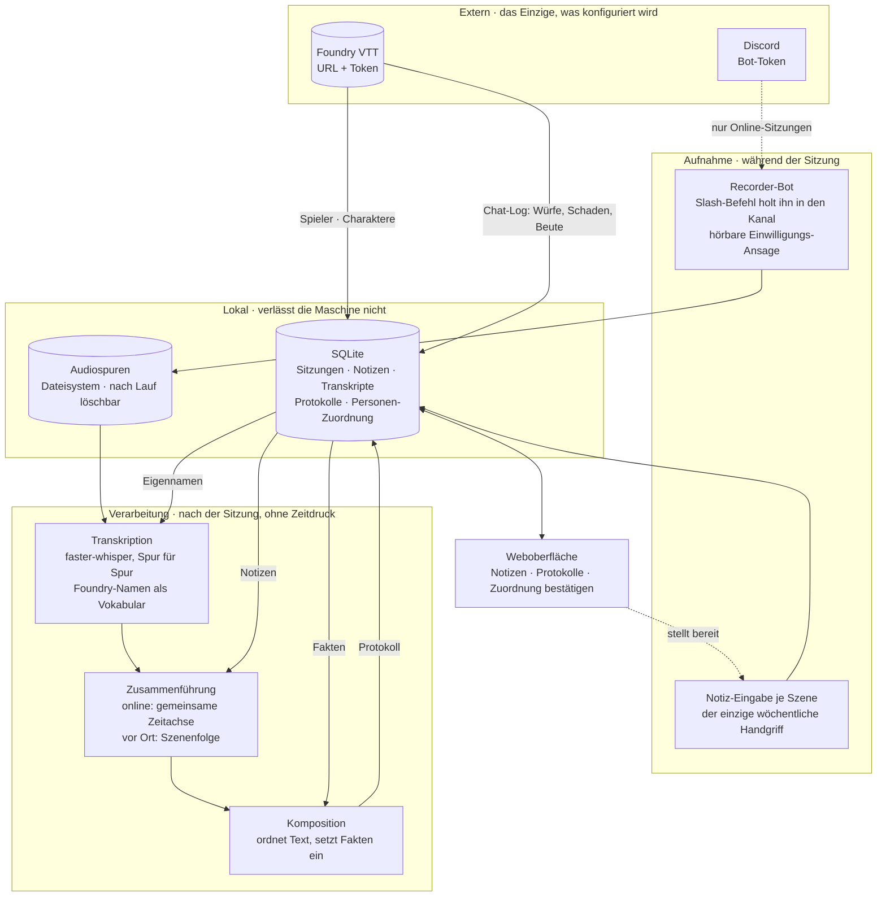

# Sitzungsprotokoll — Architektur

Eine Instanz pro Gruppe. Konfiguration: Foundry-URL + Token, Discord-Bot-Token.
Alles andere kommt aus Foundry.

## Die drei tragenden Entscheidungen

**Die Transkription ist eine vorgeschaltete Stufe, kein zweiter Weg.** Beide
Betriebsarten treffen sich bei der Zusammenführung. Eine Präsenzsitzung überspringt
schlicht den Audio-Zweig — es gibt keine zweite Pipeline zu pflegen.

**Foundry liefert die Zahlen, der Text die Erzählung.** Würfe, Schaden und Beute
werden nie aus gesprochener oder getippter Sprache rekonstruiert, sondern aus dem
Chat-Log eingesetzt. Das Modell ordnet und verknüpft; es rechnet und rät nicht.

**Alles nach der Aufnahme läuft im Stapel.** Keine Echtzeit-Transkription, damit keine
GPU-Konkurrenz und keine Latenzfrage. Läuft nachts; auf CPU langsam genug, um ohne
Grafikkarte auszukommen.

## Was die Kanten nicht zeigen

- Die **Personen-Zuordnung** Discord ↔ Foundry entsteht einmalig: automatisch
  vorgeschlagen, vom Menschen bestätigt, danach im Speicher.
- **Foundry ist eine harte Abhängigkeit.** Ist es beim Einrichten aus, bleibt das
  System leer — das braucht eine verständliche Meldung, keine leere Liste.
- Die **Audiospuren sind das Einzige, was groß wird.** Nach erfolgreichem Lauf
  löschbar; das Protokoll und das Transkript sind klein.
