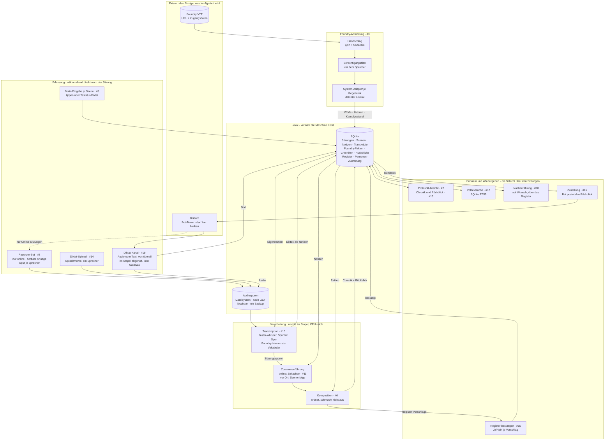

# Sitzungsprotokoll — Architektur

Eine Instanz trägt mehrere **Runden** (#62/#63). Eine Runde ist der Mandant: Schlüssel nach
außen ist die Discord-Gilde, Schlüssel nach innen die eigene Id. Jede runden-eigene Tabelle
trägt `runde_id`; gelesen und geschrieben wird ausschließlich über `db.scoped(runde)`, das
eine Abfrage ohne Runde zurückweist. Die Weboberfläche kennt noch keine Runden und arbeitet
bis zu ihrer Abschaltung (#69) stillschweigend in der ersten.

Der Lebenszyklus einer Runde hängt an der Gilde (#68, `chronicle.lebenszyklus`): Beim
Betreten sagt der Bot einmal, was er tut und **dass der Betreiber der Box alles lesen
kann**; `/setup` beansprucht die Runde für den Server oder legt sie an. Verlässt der Bot
die Gilde, wird sie sofort gesperrt und nach 30 Tagen vollständig gelöscht — Dateien
eingeschlossen. Gesperrt heißt in jedem Faden: der nächtliche Lauf überspringt sie,
Verschriften, Komponieren und Foundry-Abgleich weigern sich (`lebenszyklus.ruht`), und das
flüchtige Foundry-Passwort ist mit dem Rauswurf vergessen. Eine Wiedereinladung innerhalb
der Frist stellt sie her, danach wird gelöscht statt wiederbelebt; `/chronik loeschen`
zieht die Löschung nach Rückfrage vor. Beide Befehle verlangen ein Discord-Recht — `/setup`
die Serververwaltung, das Löschen die Administration.

Konfiguration: Foundry-Adresse und -Benutzer je Runde, Discord-Bot-Token für die Instanz —
das ist unser Token und nicht das einer Gruppe. Das Foundry-Passwort wird **nirgends**
gespeichert: es wird beim Abgleich erfragt, lebt im Arbeitsspeicher und wird verbraucht
(#64). Alles andere kommt aus Foundry.

Wie der Zugriff auf Foundry technisch läuft, steht in [`foundry-zugriff.md`](foundry-zugriff.md).

## Die drei tragenden Entscheidungen

**Die Transkription ist eine vorgeschaltete Stufe, kein zweiter Weg.** Beide
Betriebsarten treffen sich bei der Zusammenführung. Eine Präsenzsitzung überspringt
schlicht den Audio-Zweig — es gibt keine zweite Pipeline zu pflegen. Das Diktat (#14,
#19) ist derselbe Transkriptionskern, nur ohne die Discord-Vorstufen: ein Sprecher,
eine Spur, Ergebnis wird zu Notizen.

**Foundry liefert die Zahlen, der Text die Erzählung.** Würfe, Schaden und Beute
werden nie aus gesprochener oder getippter Sprache rekonstruiert, sondern aus dem
Chat-Log eingesetzt. Das Modell ordnet und verknüpft; es rechnet und rät nicht.

**Alles nach der Aufnahme läuft im Stapel.** Keine Echtzeit-Transkription, damit keine
GPU-Konkurrenz und keine Latenzfrage. Läuft nachts; auf CPU langsam genug, um ohne
Grafikkarte auszukommen. Auch die Erfassung folgt dem Prinzip: der Diktat-Kanal ist
ein Briefkasten — jetzt einwerfen, geholt wird, wenn der Dienst das nächste Mal läuft.

## Die Schicht über den Sitzungen

Das Ziel ist nicht das Archiv, sondern **wissen, was zuletzt in der Geschichte
passiert ist** — und Teile davon nacherzählen können.

- Der **Rückblick** (#13) ist das Artefakt, das wöchentlich konsumiert wird; die
  Chronik ist das Archiv dahinter. Die Zustellung nach Discord (#16) bringt ihn
  dorthin, wo die Gruppe ohnehin ist.
- Das **Register** (#15) ist ein Index, kein Wiki: Name, ein Satz, Verweise. Die
  Wahrheit über Figuren wohnt in Foundry. Vorschläge macht das Modell, bestätigt wird
  von Hand — dasselbe Muster wie die Personen-Zuordnung.
- Die **Nacherzählung** (#18) kommt bewusst zuletzt: verdichtete Prosa über Wochen von
  Material ist die Stelle mit dem höchsten Erfindungsrisiko. Sie navigiert über das
  Register; was das Register nicht kennt, kommt nicht vor.

## Was die Kanten nicht zeigen

- Alle Web-Kästen — Notiz-Eingabe, Upload, Ansicht, Suche, Register — sind **eine**
  schlanke, serverseitig gerenderte Oberfläche (#2), kein Frontend-Gerüst.
- **Die Haustür stellt die Plattform:** Subdomain hinter Authelia-Forward-Auth
  (ServiceBay-ADR 0001). Die Oberfläche selbst kennt kein Login und keine Konten —
  sie erzwingt nur den `Remote-User`-Header, sobald echte Inhalte drinstehen.
- Die **Personen-Zuordnung** Discord ↔ Foundry entsteht einmalig: automatisch
  vorgeschlagen, vom Menschen bestätigt, danach im Speicher.
- **Foundry ist eine harte Abhängigkeit.** Ist es beim Einrichten aus, bleibt das
  System leer — das braucht eine verständliche Meldung, keine leere Liste. Die
  Fakten werden deshalb zwischengespeichert, nicht bei jedem Aufruf geholt.
- Der Stapel zeigt **ehrlichen Status statt Fortschritt**: „läuft im nächsten Stapel,
  Ergebnis morgen früh" — kein Balken, der Echtzeit vortäuscht, die es nicht gibt.
- **Den Stapel stößt der Webdienst an**, in einem Faden, zu einer Uhrzeit aus den
  Einstellungen. Nicht der Aufnahme-Bot, den es ohne Bot-Token gar nicht gibt, und kein
  dritter Prozess: ein Lauf ist eine Zeile in der `job`-Tabelle, und deren
  Absturzerkennung trägt nur, solange genau einer solche Zeilen anlegt. Ein verpasstes
  Fenster wird nicht nachgeholt — die nächste Nacht genügt.
- **Die Uhrzeit gehört einer Zeitzone, und die gehört der Runde.** Der Container läuft in
  UTC und bleibt dabei: eine Instanz trägt mehrere Runden, ein festes `TZ` im Pod könnte
  immer nur einer davon recht geben. Neben der Uhrzeit steht deshalb eine Zone je Runde
  (Vorgabe `Europe/Berlin`); gerechnet wird über `zoneinfo`, damit 04:00 im Sommer wie im
  Winter 04:00 heißt.
- Die **Audiospuren sind das Einzige, was groß wird.** Nach erfolgreichem Lauf
  löschbar; Protokoll und Transkript sind klein. Der Diktat-Kanal läuft durch Discords
  Cloud — für Online-Gruppen kein Unterschied, für reine Präsenzgruppen eine bewusste
  Entscheidung.
- **Der Diktat-Kanal wird abgeholt, nicht abonniert.** Der Stapellauf fragt Discords
  REST-API, was seit dem letzten Zeiger dazugekommen ist; ein Prozess, der dauernd an
  einer WebSocket hängt, wäre für einen Briefkasten die falsche Bauform und müsste
  laufen, damit nichts verlorengeht. Die Gateway-Verbindung kommt erst mit dem
  Recorder-Bot (#8), der Sprache mitschneidet, während sie gesprochen wird.
