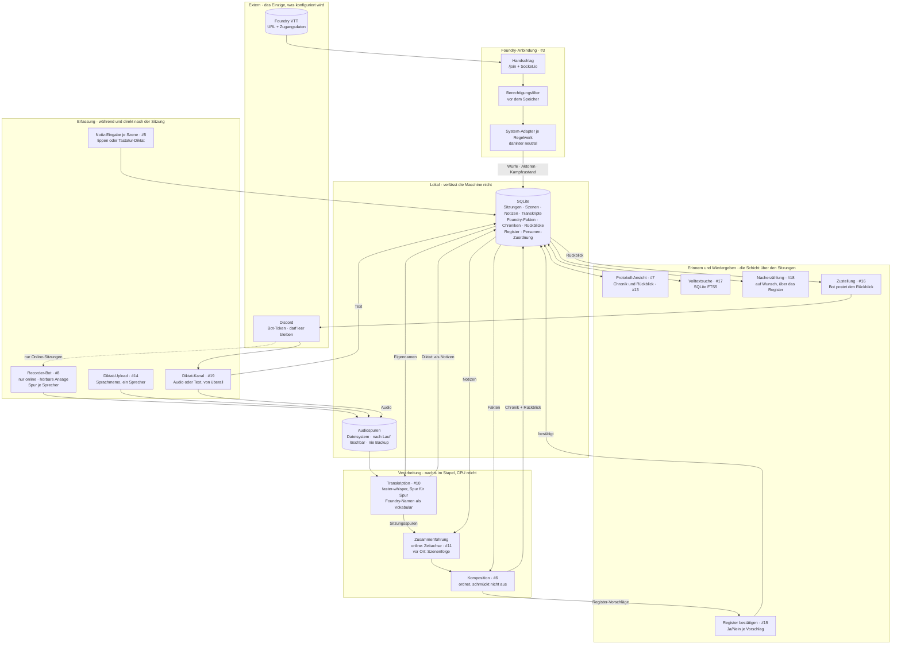

# Sitzungsprotokoll — Architektur

Eine Instanz pro Gruppe. Konfiguration: Foundry-URL + Zugangsdaten, Discord-Bot-Token.
Alles andere kommt aus Foundry.

Wie der Zugriff auf Foundry technisch läuft, steht in [`foundry-zugriff.md`](foundry-zugriff.md).

## Die drei tragenden Entscheidungen

**Die Transkription ist eine vorgeschaltete Stufe, kein zweiter Weg.** Beide
Betriebsarten treffen sich bei der Zusammenführung. Eine Präsenzsitzung überspringt
schlicht den Audio-Zweig — es gibt keine zweite Pipeline zu pflegen. Das Diktat (#14,
#19) ist derselbe Transkriptionskern, nur ohne die Discord-Vorstufen: ein Sprecher,
eine Spur, Ergebnis wird zu Notizen.

**Foundry liefert die Zahlen, der Text die Erzählung.** Würfe, Schaden und Beute
werden nie aus gesprochener oder getippter Sprache rekonstruiert, sondern aus dem
Chat-Log eingesetzt. Das Modell ordnet und verknüpft; es rechnet und rät nicht.

**Alles nach der Aufnahme läuft im Stapel.** Keine Echtzeit-Transkription, damit keine
GPU-Konkurrenz und keine Latenzfrage. Läuft nachts; auf CPU langsam genug, um ohne
Grafikkarte auszukommen. Auch die Erfassung folgt dem Prinzip: der Diktat-Kanal ist
ein Briefkasten — jetzt einwerfen, geholt wird, wenn der Dienst das nächste Mal läuft.

## Die Schicht über den Sitzungen

Das Ziel ist nicht das Archiv, sondern **wissen, was zuletzt in der Geschichte
passiert ist** — und Teile davon nacherzählen können.

- Der **Rückblick** (#13) ist das Artefakt, das wöchentlich konsumiert wird; die
  Chronik ist das Archiv dahinter. Die Zustellung nach Discord (#16) bringt ihn
  dorthin, wo die Gruppe ohnehin ist.
- Das **Register** (#15) ist ein Index, kein Wiki: Name, ein Satz, Verweise. Die
  Wahrheit über Figuren wohnt in Foundry. Vorschläge macht das Modell, bestätigt wird
  von Hand — dasselbe Muster wie die Personen-Zuordnung.
- Die **Nacherzählung** (#18) kommt bewusst zuletzt: verdichtete Prosa über Wochen von
  Material ist die Stelle mit dem höchsten Erfindungsrisiko. Sie navigiert über das
  Register; was das Register nicht kennt, kommt nicht vor.

## Was die Kanten nicht zeigen

- Alle Web-Kästen — Notiz-Eingabe, Upload, Ansicht, Suche, Register — sind **eine**
  schlanke, serverseitig gerenderte Oberfläche (#2), kein Frontend-Gerüst.
- Die **Personen-Zuordnung** Discord ↔ Foundry entsteht einmalig: automatisch
  vorgeschlagen, vom Menschen bestätigt, danach im Speicher.
- **Foundry ist eine harte Abhängigkeit.** Ist es beim Einrichten aus, bleibt das
  System leer — das braucht eine verständliche Meldung, keine leere Liste. Die
  Fakten werden deshalb zwischengespeichert, nicht bei jedem Aufruf geholt.
- Der Stapel zeigt **ehrlichen Status statt Fortschritt**: „läuft im nächsten Stapel,
  Ergebnis morgen früh" — kein Balken, der Echtzeit vortäuscht, die es nicht gibt.
- Die **Audiospuren sind das Einzige, was groß wird.** Nach erfolgreichem Lauf
  löschbar; Protokoll und Transkript sind klein. Der Diktat-Kanal läuft durch Discords
  Cloud — für Online-Gruppen kein Unterschied, für reine Präsenzgruppen eine bewusste
  Entscheidung.
