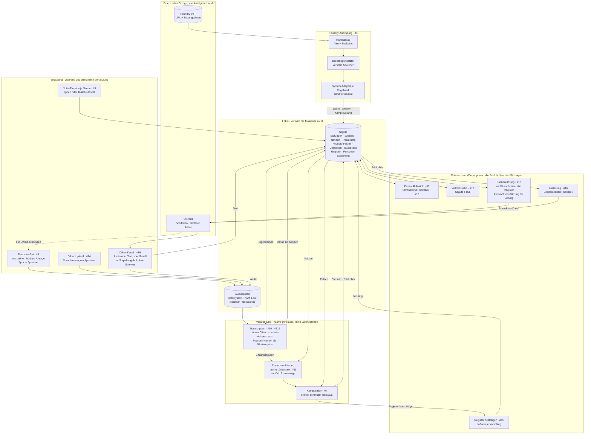

# Sitzungsprotokoll — Architektur

Eine Instanz trägt mehrere **Runden** (#62/#63). Eine Runde ist der Mandant: Schlüssel nach
außen ist die Discord-Gilde, Schlüssel nach innen die eigene Id. Jede runden-eigene Tabelle
trägt `runde_id`; gelesen und geschrieben wird ausschließlich über `db.scoped(runde)`, das
eine Abfrage ohne Runde zurückweist. Eine Oberfläche daneben gibt es nicht: die
Betreiber-Seite ist mit #231 gefallen, der Dienst ist ein einzelner Bot-Prozess.

Der Lebenszyklus einer Runde hängt an der Gilde (#68, `chronicle.lebenszyklus`): Beim
Betreten sagt der Bot einmal, was er tut und **dass der Betreiber der Box alles lesen
kann**; `/chronicle setup` beansprucht die Runde für den Server oder legt sie an. Discord spielt das
Betreten nach einer Wiederverbindung nicht nach — fällt die Autorisierung in einen
Neustart, holt `on_ready` den Satz nach, **einmal je Gilde** (#270; der Vermerk steht unter
`begruesst:<gilde>` in `meta`, weil eine Gilde ohne Runde keine eigene Zeile hat). Verlässt der Bot
die Gilde, wird sie sofort gesperrt und nach 30 Tagen vollständig gelöscht — Dateien
eingeschlossen. Gesperrt heißt in jedem Faden: der nächtliche Lauf überspringt sie,
Verschriften, Komponieren und Foundry-Abgleich weigern sich (`lebenszyklus.ruht`), und das
flüchtige Foundry-Passwort ist mit dem Rauswurf vergessen. Eine Wiedereinladung innerhalb
der Frist stellt sie her, danach wird gelöscht statt wiederbelebt; `/chronicle delete`
zieht die Löschung nach Rückfrage vor. Beide Befehle verlangen ein Discord-Recht — `/chronicle setup`
die Serververwaltung, das Löschen die Administration.

**Über der Runde steht niemand** (#90). Es gibt keine Instanz-Ebene, über die der Betreiber
eine fremde Runde sperrt oder löscht: eine Runde verschwindet, weil ihre Gruppe es sagt
oder weil die Frist abläuft — sonst gar nicht. Der Bot sagt beim Betreten, dass der
Betreiber alles lesen kann; ein Löschknopf für ihn käme als zweite Zusage obendrauf, dass
er die Chronik einer Gruppe auch fortnehmen kann, ohne dass sie es merkt. An der Datenbank
steht ihm ohnehin alles offen — der Unterschied ist, dass es dafür kein Bedienelement gibt.
`lebenszyklus.loeschen` und `sperren` haben deshalb genau einen Aufrufer außerhalb des
Moduls: den Discord-Weg der Gruppe selbst.

Konfiguration: Foundry-Adresse und -Benutzer je Runde, Discord-Bot-Token für die Instanz —
das ist unser Token und nicht das einer Gruppe. Er steht seit #230 in der Umgebung
(`DISCORD_BOT_TOKEN`, gesetzt von den Template-Variablen der Box) und in keiner Zeile der
SQLite; dasselbe gilt für Ollama-Adresse und -Modell. Das Foundry-Passwort wird **nirgends**
gespeichert: es wird beim Sitzungsstart erfragt — freiwillig und nur, wo ein Foundry-Server
im Spiel ist —, lebt im Arbeitsspeicher und wird vom Abgleich verbraucht (#64/#96). Wer
beim Start keines gibt, wird beim Abschluss gefragt; und gefragt wird auch, wessen
Abschluss auf der Eingabe eines anderen säße. Alles andere kommt aus Foundry.

Solange die Sitzung offen ist, **liest** der Ereignisstrom (#97) denselben Merkzettel, ohne
ihn zu verbrauchen — sonst sähe er genau einmal nach. Abgelegt oder verlängert wird dabei
nichts: es bleibt bei den zwölf Stunden aus #64, und der Abschluss löst ihn ein. Ist er
abgelaufen oder eingelöst, endet der Strom von selbst und sagt es einmal.

Wie der Zugriff auf Foundry technisch läuft, steht in [`foundry-zugriff.md`](foundry-zugriff.md).

## Die drei tragenden Entscheidungen

**Die Transkription ist eine vorgeschaltete Stufe, kein zweiter Weg.** Beide
Betriebsarten treffen sich bei der Zusammenführung. Eine Präsenzsitzung überspringt
schlicht den Audio-Zweig — es gibt keine zweite Pipeline zu pflegen. Das Diktat (#14,
#19) ist derselbe Transkriptionskern, nur ohne die Discord-Vorstufen: ein Sprecher,
eine Spur, Ergebnis wird zu Notizen.

Den Übergang vom Transkript zur Notiz geht seit #140 der Abschluss selbst
(Betreiber-Entscheidung 2026-08-12): `/session done` legt das zusammengeführte
Gespräch in die Szenen, und zwar über die **Sitzungsuhr** — jede Äußerung fällt in die
Szene ihres Startzeitpunkts. Voraussetzung ist, dass der Nullpunkt dieser Uhr in
`recording.started_at` steht; er wird beim Start des Mitschnitts festgehalten, nie
später geschätzt. Seit #217 schneidet der Recorder eine Sprecherspur in **Häppchen** von
fünf Minuten (bis #269 dreißig), und seither läuft die Verschriftung auch wirklich während
der Sitzung: `chronicle.mitlauf` sieht im Bot-Prozess minütlich in die Warteschlange, in
einem eigenen Faden neben der Ereignisschleife und still — sichtbar wird weiterhin erst,
was am Ende steht, nur eben früher. Alle
Häppchen einer Aufnahme tragen denselben Nullpunkt, und wo die einzelne Datei auf der Uhr
liegt, sagt `recording.offset_ms`. Aufgeschlagen wird er vor dem Speichern — was in
`transcript_segment` steht, bleibt sitzungsabsolut, und die Verschränkung merkt vom
Schnitt nichts. Ein Auswahlweg in Discord ist bewusst verworfen. Was aus den Spuren
kommt, wird bei jedem Lauf ersetzt (`note.origin`); was ein Mensch geschrieben hat,
bleibt unangetastet. **Ein Diktat hat keine Sitzungsuhr** und wird deshalb nicht
verschränkt — es bekommt seine Szene über den Zeitpunkt der **Nachricht**, mit der es im
Kanal der Sitzung ankam (`recording.message_at`, #160): dieselbe Regel, nach der eine getippte Notiz
ihre Szene findet, und derselbe `note.origin`, also ersetzt der zweite Lauf auch hier.
Für den Präsenzweg bleibt die Szenenfolge die einzige Zeitachse.

**Foundry liefert die Zahlen, der Text die Erzählung.** Würfe, Schaden und Beute
werden nie aus gesprochener oder getippter Sprache rekonstruiert, sondern aus dem
Chat-Log eingesetzt. Das Modell ordnet und verknüpft; es rechnet und rät nicht.

Seit #97 kommen sie **während** der Sitzung: liegt ein Passwort im Speicher, sieht der Bot
alle zwei Minuten nach und stellt neue Würfe in den Kanal der Sitzung — durch denselben
Berechtigungsfilter und denselben System-Adapter wie der Abgleich, und ohne Rückkanal.
Damit ist die Reihenfolge keine Rekonstruktion aus Zeitstempeln mehr: der Wurf hängt an der
Szene, die lief, als er fiel. Angehängt wird er als **Fakt** an dieser Szene und nicht als
Notiz — sonst verlöre die Chronik genau die Grenze zwischen Belegtem und Verbindungssatz,
für die es diesen Weg gibt. Wie oft nachgesehen wird, ist eine Betriebsfrage: eine Runde
soll ein fremdes Foundry nicht wund fragen.

**Der Sitzungskanal ist die Gruppe, nicht das Konto.** Vor ihm liegt deshalb eine zweite, engere
Grenze als vor dem Archiv: dort entscheidet die Berechtigungsstufe des angemeldeten Kontos,
was gespeichert wird — hier entscheidet, ob die Nachricht für **alle** bestimmt war. Ein
Geflüster an unser Konto ist es nicht, ein blinder Wurf auch nicht, und mit einem
GM-Zugang (#78) käme sonst beides mitten im Spiel dort an, wo die Runde mitliest. Voll
bleibt davon unberührt das **Archiv** (`foundry_message`); die Chronik nicht — sie liest
`scene_foundry_message`, und dort steht nur, was diese engere Grenze passiert hat. Die
frühere Fassung sagte, eingeengt sei nur der Weg in den Kanal; das war ungenau (#219).

**Und der Abschluss trägt nach, was der Strom nicht geholt hat** (#219). Der Strom war
lange der einzige Schreiber von `scene_foundry_message` — wer beim Sitzungsstart kein
Passwort hinterlegte, spielte einen Abend, an dessen Ende der Abgleich zwar das ganze
Chat-Log holte, die Chronik aber keine einzige Zahl trug. Seither hängt `/session done`
die Würfe dieses Abends über ihre Zeitstempel an die Szenen: durch **denselben** engeren
Filter wie der Strom, ohne anzufassen, was schon hängt, und ohne Auffanglinie — ein Wurf,
der in keine Szene dieser Sitzung fällt, wird nicht untergebracht, sondern gar nicht. Das
Chat-Log trägt die ganze Kampagne, und eine erste Szene, die alles Frühere auffängt, wäre
die teuerste Sorte Zuordnung. Kommt der Abgleich nicht durch — kein Passwort, Foundry aus
—, kommt auch keine Zahl, und der Abschluss sagt das im ersten Satz statt es zu übergehen.

Die Grenze des Weges: der Strom lebt im Arbeitsspeicher wie das Passwort. Ein Neustart des
Bots beendet ihn **stumm** — verloren geht nichts, der Abschluss holt alles noch einmal
ganz und ordnet es seit #219 auch zu, aber bis dahin spielt die Runde in dem Glauben
weiter, die Würfe kämen noch. Was der Nachtrag nicht heilt, ist eine Sitzung, die **nach**
dem Spielabend angelegt wurde: liegen alle Würfe vor ihrer ersten Trennlinie, gehören sie
keiner ihrer Szenen, und geraten wird nicht.

**Alles nach der Aufnahme läuft im Stapel.** Keine Echtzeit-Transkription, damit keine
GPU-Konkurrenz und keine Latenzfrage. Läuft nachts; auf CPU langsam genug, um ohne
Grafikkarte auszukommen. Auch die Erfassung folgt dem Prinzip: der Diktat-Kanal ist
ein Briefkasten — jetzt einwerfen, geholt wird, wenn der Dienst das nächste Mal läuft.

**Der Szenenschnitt ist ein zweiter Stapellauf, kein zweiter Weg** (#294, seit
2026-08-25). Schließt die Runde eine Szene, wird *diese* Szene verdichtet, und das
Ergebnis geht als Zwischenstand in den Thread. Verschriftet wird dafür **nichts**
nachgeholt: `chronicle.mitlauf` schneidet und verschriftet seit #269 in Häppchen von
fünf Minuten, während gespielt wird — der Text liegt am Schnitt bereits vor, und die
Würfe hängt der Ereignisstrom ohnehin live an ihre Szene. Neu ist allein der Auslöser.
Die Latenzfrage stellt sich dabei nicht: es wartet niemand, die nächste Szene läuft
bereits. Wo keine Karte steht, fällt der Zwischenstand aus, ohne dass die Chronik am Ende
darunter leidet.

Die GPU-Konkurrenz stellt sich schon — **und sie ist zugunsten des Nachbarn entschieden**
(#303, seit 2026-08-26). #295 hatte die Sitzung das große Modell festhalten lassen; die
Messung des Nachbardienstes hat ergeben, dass beide Modelle auf der 16,4-GB-Karte nicht
koexistieren. Also die verabredete Rückfallebene: gehalten wird nicht, der Tausch je
Szenenschnitt wird in Kauf genommen. Ersatzlos streichen ginge dabei nicht — der
Ollama-Dienst dieser Box setzt `OLLAMA_KEEP_ALIVE=24h`, und ein Aufruf ohne eigenes
`keep_alive` erbt sie. Jeder Aufruf trägt deshalb eine knappe Frist, und am Ende jedes
Aufschriebs steht die ausdrückliche Freigabe (#300).

**Seit #299 gibt es dazu eine benannte Ausnahme: das Sitzungsfenster** (2026-08-27,
ausgehandelt mit `mdopp/solarisbay#1260`, von beiden Betreibern entschieden). Der Beginn
eines Abends wird beim Nachbarn angemeldet — `POST /napi/gpu-lease {model, ttl_s}` über
die Schleife, fünfzehn Minuten, alle fünf erneuert —, und am Ende jedes Aufschriebs
schließt dieselbe Stelle, die das Modell freigibt, das Fenster mit einem `DELETE` wieder.
Solange es steht, antwortet der Nachbar mit unserem Modell, statt seines bei jeder
Haushaltsanfrage zurückzuholen; die Rechnung dahinter ist, dass eine langsamere Antwort
billiger ist als zwei Ladevorgänge zu je rund 56 s. Dass die beiden Modelle nicht
nebeneinander passen, ist dabei die **Prämisse** des Vertrags und nicht der Einwand
dagegen. Die knappe Frist bleibt die Norm — Fensterfrist und `keep_alive` kommen aus
**derselben Konstante**, damit nicht zwei Zahlen auseinanderlaufen —, und der Aufruf ist
in beide Richtungen bester Wille: scheitert er, beginnt und endet die Sitzung trotzdem.
Er trägt kein Geheimnis (seit #230 hat diese Instanz keines) und **keine Runden-, Gilden-
oder Sitzungskennung**: welches Modell, wie lange — mehr braucht der Nachbar nicht.
Die Anmeldung lädt das Modell gleich mit; damit zahlt der erste Szenenschnitt des Abends
den Ladevorgang nicht mehr, und das tut sie **nach** der Zusage, nicht davor. Abschalten
lässt sich der Vertrag ohne Neubau mit `CHRONICLE_GPU_LEASE`.

**Der Zwischenstand hat als einziger Weg eine Zeitrichtung** (#302). Ein bis drei Minuten
nach dem Schnitt, sonst ist er zwecklos — während der Aufschrieb am Sitzungsende lange
rechnen darf. Beide teilten sich bis dahin eine Zeitgrenze, und die muss für eine der
Seiten falsch sein: mit den 1800 Sekunden des Aufschriebs besetzte ein hängendes Modell
den Job-Platz eine halbe Stunde und schluckte jeden weiteren Schnitt des Abends. Der
Zwischenstand läuft deshalb gegen eine eigene, knappe Grenze; reißt sie, fällt er still
aus wie ohne Modell.

Er ist **Deutung, nie Beleg**, und er sagt das über sich selbst. Abgelegt wird er
nirgends — keine Notiz, keine Zeile in `protocol` —, also kann die Chronik am Ende ihn
strukturell nicht als Fakt zurücklesen. Und er fasst den Merkzettel aus #64 nicht an:
das Foundry-Passwort gehört dem Abschluss am Abendende, und ein Schnitt, der es
verbrauchte, ließe die Chronik ohne ihre Zahlen dastehen.

Der Anlass steht im Abend vom 18.08.: er wurde zu **einer** Szene mit **einer** Notiz
über 17.806 Zeichen, obwohl der Spielleiter den Schnitt zweimal laut ansagte. Der
Befehl dafür gab es; benutzt wurde er nicht. Ein Zeittakt statt des Schnitts wäre die
schlechtere Grenze — er endet mitten im Satz, und über eine unfertige Szene erfindet ein
Modell den Abschluss.

## Die Schicht über den Sitzungen

Das Ziel ist nicht das Archiv, sondern **wissen, was zuletzt in der Geschichte
passiert ist** — und Teile davon nacherzählen können.

- Der **Rückblick** (#13) ist das Artefakt, das wöchentlich konsumiert wird; die
  Chronik ist das Archiv dahinter. Die Zustellung nach Discord (#16) bringt ihn
  dorthin, wo die Gruppe ohnehin ist.
- Das **Register** (#15) ist ein Index, kein Wiki: Name, ein Satz, Verweise. Die
  Wahrheit über Figuren wohnt in Foundry. Vorschläge macht das Modell, bestätigt wird
  von Hand — dasselbe Muster wie die Personen-Zuordnung.
- Die **Nacherzählung** (#18) kommt bewusst zuletzt: verdichtete Prosa über Wochen von
  Material ist die Stelle mit dem höchsten Erfindungsrisiko. Sie navigiert über das
  Register; was das Register nicht kennt, kommt nicht vor. **Ausgewählt wird über einen
  Sitzungsbereich** (Operator-Entscheidung 2026-08-11) — von welchem Abend bis zu welchem,
  nicht über einen Handlungsfaden und nicht über eine Figur. Gearbeitet wird rollierend wie
  in der Komposition: je Sitzung ein Aufruf, mitgeführt wird nur der zuletzt angenommene
  Absatz. Eine Sitzung ohne bestätigten Registereintrag wird als **Lücke benannt** statt
  überbrückt; die Zahlenschranke läuft je Sitzung gegen ihre Chronik und ihre
  Registereinträge, und die Überschriften setzt die Stufe selbst — ein Absatz, der sich
  eine eigene aufmacht, wird verworfen. Der Lauf gehört
  dem Server, nicht dem Befehl, und das Ergebnis geht als Markdown-Datei in den Kanal, in
  dem es angefordert wurde.

## Was die Kanten nicht zeigen

- Was einmal Web-Kästen waren — Notiz-Eingabe, Upload, Ansicht, Suche, Register — sind
  seit #157 Discord-Befehle. Was danach noch als Seite dastand — Bot-Token und Ollama bis
  #230, die Verwaltungsgruppe bis #231 — ist fort. **Über HTTP antwortet allein
  `/healthz`**, das Install-Gate der Box, aus dem Bot-Prozess und nur auf `127.0.0.1`
  (#228). Kein Rahmenwerk mehr: zehn Zeilen `http.server`.
- **Eine Haustür gibt es nicht mehr, weil es kein Haus mehr gibt.** Bis #231 stand die
  Seite auf einer Subdomain hinter Authelia-Forward-Auth (ServiceBay-ADR 0001), erzwang
  den `Remote-User`-Header und glaubte ihn nur, wenn der Aufruf von **dieser Maschine**
  kam, wo der Proxy läuft (#190) — ohne dieses zweite Stück war die Haustür keine, denn
  der Port lag im Host-Netz offen und die Kopfzeile schreibt sich jeder selbst. Jetzt gibt
  es weder Seite noch Port noch Kopfzeile; `chronicle.herkunft` und `chronicle.roles` sind
  mit ihr gefallen. ADR 0001 bindet den Dienst nicht mehr — er ist nicht user-facing.
- **Dass der Pod im Host-Netz liegt, ist eine erklärte Abweichung** von ServiceBays
  ADR 0007 (#165) und keine Nachlässigkeit: der Dienst spricht die Nachbarn der Box über
  die Schleife an — Ollama (`127.0.0.1:11434`) schreibt die Chronik, `solaris-tts`
  (`127.0.0.1:8881`) spricht die Ansage, `solaris-whisper-batch` (`127.0.0.1:10301`)
  verschriftet —, und alle drei binden nur an Loopback. Eine benannte Ausnahme wurde in
  `mdopp/servicebay#2518` erfragt und verneint. **Was sie kostete, ist mit #231 weg statt
  gedeckt:** der offene Port war der Port der Seite, und die gibt es nicht mehr. Die
  Abweichung fällt, sobald die Nachbarn auch aus einem eigenen Netz-Namensraum erreichbar
  sind. Das Warum in ganzer Länge steht in `CLAUDE.md` und im Template.
- Die **Personen-Zuordnung** Discord ↔ Foundry entsteht einmalig, und zwar **beim
  Betreten des Sprachkanals** (#76), damit jede Äußerung von Anfang an einer Figur
  gehört. Ohne Rückfrage gesetzt wird sie nur bei **1:1 gleichem Namen** — der Discord-Name
  ist Zeichen für Zeichen der eines freien Foundry-Kontos oder einer seiner Spielfiguren,
  eindeutig und von niemandem sonst getragen (Betreiber-Entscheidung 2026-08-12). Das ist
  kein Vorschlag, sondern ein Beleg. **Eindeutig heißt: gegen alle Konten der Runde
  geprüft**, und erst danach wird das Vergebene abgezogen — andersherum verschwände die
  Mehrdeutigkeit zweier Gleichnamiger genau dann, wenn eines der beiden schon vergeben ist.
  Alles andere — Ähnlichkeit, zwei gleichnamige Konten, ein vergebenes, ein Gast — wird
  **die betroffene Person selbst** im Zwiegespräch gefragt, mit einem Menü der freien
  Konten; wer wer ist, entscheidet man über sich selbst. Keine Antwort ist auch eine: die
  Spur bleibt unter dem Discord-Namen, und das Protokoll sagt es so.
- **Erst schreiben, dann vermerken** — und das ist die schwächere, ehrliche Zusage. Über
  SQLite und Discord hinweg gibt es kein gemeinsames Zusammenschreiben; eine der beiden
  Reihenfolgen muss danebengehen können, also gilt die, deren Fehlerfall **Schweigen** ist
  und keine Lüge im Kanal. Kommt der Vermerk nicht hinaus, wird die Zuordnung
  zurückgenommen — und zwar **nur, wenn dort noch genau das steht, was eben geschrieben
  wurde**: dazwischen liegt ein Gang ans Netz, und wer in diesem Fenster über `/chronicle zuordnung`
  dieselbe Person umhängt, verlöre seine Entscheidung sonst still. **Scheitert auch die
  Rücknahme, steht eine wahre Zuordnung ohne Ansage da** — selten, Discord muss zweimal
  versagen, während die Datenbank arbeitet; der Fehlerfall ist Schweigen statt einer Lüge,
  aber er ist echt und wird hier nicht weggeschrieben. **Nachgeholt wird nichts:** ein
  Satz, der Stunden später eine Verbindung von vorhin behauptet, wäre die teurere
  Erfindung. Die frühere Fassung versprach umgekehrt »keine Zuordnung, von der die Runde
  nichts erfährt«; das war garantiert um den Preis, dass ein gescheitertes Festschreiben
  einen Vermerk stehenließ, der eine Verbindung behauptete, die es nicht gab. Eine Zusage,
  die die Wirklichkeit nicht halten kann, ist schlimmer als eine ehrliche schwächere.
- **Je schwächer der Beleg, desto mehr Tageslicht** (Betreiber-Entscheidung 2026-08-12).
  Deshalb steht auch die im Zwiegespräch **gewählte** Zuordnung im Kanal — sie hat keinen
  Beleg, nur eine Antwort, und der Satz sagt, wie sie zustande kam: gewählt, nicht erkannt.
  Über Namen sagt er **nichts**: ins Menü führt auch die Mehrdeutigkeit, und dort ist der
  Name gerade derselbe. Anders als beim 1:1-Vermerk ist der Weg in den Kanal dort keine
  Bedingung: dort entscheidet niemand, hier hat die Person selbst geantwortet.
- **Korrigiert wird in `/chronicle zuordnung`, und nur dort darf ein Konto umgehängt werden.** Der
  Fall ist echt: benennt sich Brok in »Mira« um, während die echte Mira »Mira am Handy«
  heißt, bekommt Brok beim Betreten Miras Konto. Im **Zwiegespräch** geht das Umhängen
  nicht: dort sitzt eine Person allein vor einer Liste, niemand sieht zu, und ein
  vergebenes Konto wird abgewiesen. »Erst zurücknehmen, dann setzen« wäre die schlechtere
  Antwort — zwei Schritte in der Zeile einer anderen Person, und dazwischen liegt das
  Konto frei.
- **Die Übernahme wird gesagt, nicht bloß getan.** Sie ist der Schritt mit der größten
  Folge und war der stillste: die Antwort auf den Klick sieht nur, wer geklickt hat, und in
  der Zuordnung bleibt danach genau eine Zeile stehen. Dass `/chronicle zuordnung` die Runde
  nebeneinander zeigt, trägt das **nicht** — die Ansicht reicht bis `PRO_SEITE`, und ab der
  sechsten Person steht die Vorbesitzerin weder vorher noch nachher darin. Also ein
  **Vermerk im Sitzungskanal**, der beide nennt, und eine **Nachricht an die Vorbesitzerin**.
  Der Kanal ist der belastbare Weg; ein geschlossenes Postfach wird protokolliert und verwirft
  die Übernahme nicht.
- **`/chronicle zuordnung` kennt keinen `_wer`-Abgleich** — jedes Mitglied handelt in jeder Zeile.
  Das ist so gewollt: nach #62 entscheiden Discords Kanal- und Rollenrechte, wer den Befehl
  überhaupt sieht, und ein zweites Rollenmodell daneben gibt es für Spielinhalte nicht. Seit
  dem Umhängen ist es tragend und steht deshalb ausgeschrieben da statt vorausgesetzt. Beim
  **Betreten** liegt es anders: die Frage steht im Zwiegespräch, sie gilt einer Person, und
  nur die beantwortet sie — dort wird die Kennung sehr wohl geprüft.
- Ob **ohne Rückfrage** zugeordnet werden darf, entscheidet auch, wer sonst noch so heißt
  — und gefragt wird dafür das **ganze Einwilligungsprotokoll der Runde, für immer**. Ein
  Gast, der vor einem Jahr einmal dabei war, schaltet den Zweig für sein Namensdoppel
  dauerhaft ab; dann steht dort auf Dauer das Menü. Das ist die konservative Richtung: es
  wird gefragt statt geraten, und der Preis ist ein Klick.
- **Foundry ist eine harte Abhängigkeit.** Ist es beim Einrichten aus, bleibt das
  System leer — das braucht eine verständliche Meldung, keine leere Liste. Die
  Fakten werden deshalb zwischengespeichert, nicht bei jedem Aufruf geholt.
- Der Stapel zeigt **ehrlichen Status statt Fortschritt**: „läuft im nächsten Stapel,
  Ergebnis morgen früh" — kein Balken, der Echtzeit vortäuscht, die es nicht gibt.
- **Den Stapel stößt der Bot-Prozess an** (#229), in einem Faden neben der
  Gateway-Verbindung, zu einer Uhrzeit aus `/chronicle setup`. Kein zweiter Prozess: ein Lauf ist
  eine Zeile in der `job`-Tabelle, und deren Absturzerkennung trägt nur, solange genau
  einer solche Zeilen anlegt. Ohne Bot-Token verbindet er sich zwar nicht, bleibt aber
  liegen und antwortet weiter am Gate — dann gibt es allerdings auch keinen Eingang, für
  den es nachts etwas zu tun gäbe. Ein verpasstes Fenster wird nicht nachgeholt — die
  nächste Nacht genügt.
- **Die Uhrzeit gehört einer Zeitzone, und die gehört der Runde.** Der Container läuft in
  UTC und bleibt dabei: eine Instanz trägt mehrere Runden, ein festes `TZ` im Pod könnte
  immer nur einer davon recht geben. Neben der Uhrzeit steht deshalb eine Zone je Runde
  (Vorgabe `Europe/Berlin`); gerechnet wird über `zoneinfo`, damit 04:00 im Sommer wie im
  Winter 04:00 heißt.
- Die **Audiospuren sind das Einzige, was groß wird.** Nach erfolgreichem Lauf
  löschbar; Protokoll und Transkript sind klein. Der Diktat-Kanal läuft durch Discords
  Cloud — für Online-Gruppen kein Unterschied, für reine Präsenzgruppen eine bewusste
  Entscheidung.
- **Der Diktat-Kanal wird abgeholt, nicht abonniert.** Der Stapellauf fragt Discords
  REST-API, was seit dem letzten Zeiger dazugekommen ist; ein Prozess, der dauernd an
  einer WebSocket hängt, wäre für einen Briefkasten die falsche Bauform und müsste
  laufen, damit nichts verlorengeht. Die Gateway-Verbindung kommt erst mit dem
  Recorder-Bot (#8), der Sprache mitschneidet, während sie gesprochen wird.
